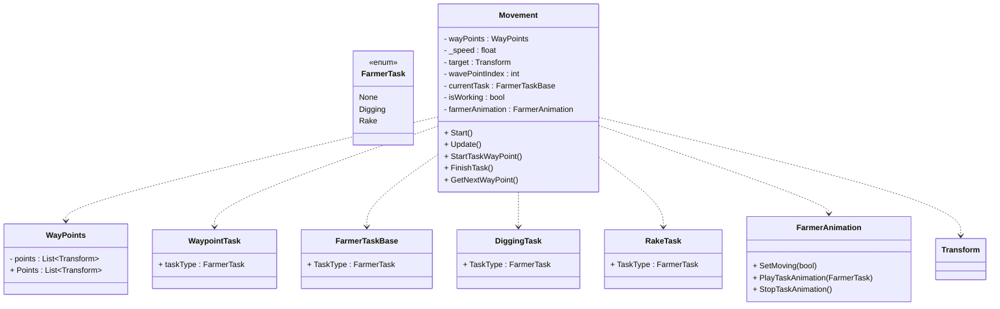

```mermaid
---
Title: Class Diagram Unitled Goose (Farmer TD)
---

classDiagram 

%% ENUM
class FarmerTask {
    <<enum>>
    None
    Digging
    Rake
}


%% ABSTRACTE CLASS

class FarmerTaskBase {
    + TaskType : FarmerTask
}


%% Tasks

class DiggingTask {
    + TaskType : FarmerTask
}


class RakeTask {
    + TaskType : FarmerTask
}

%% WAYPOINT System

class WayPoints {
    - points : List~Transform~
    + Points : List~Transform~
}

class WaypointTask {
    + taskType : FarmerTask
}


%% MOVEMENT

class Movement {
    - wayPoints : WayPoints
    - _speed : float
    - target : Transform
    - wavePointIndex : int
    - currentTask : FarmerTaskBase
    - isWorking : bool
    - farmerAnimation : FarmerAnimation

    + Start()
    + Update()
    + StartTaskWayPoint()
    + FinishTask()
    + GetNextWayPoint()
}


%% ANIMATION 

class FarmerAnimation {
    + SetMoving(bool)
    + PlayTaskAnimation(FarmerTask)
    + StopTaskAnimation()
}


%% RELATIONS

%%/Dependancy 
Movement ..> WayPoints
Movement ..> WaypointTask
Movement ..> FarmerTaskBase
Movement ..> DiggingTask
Movement ..> RakeTask
Movement ..> FarmerAnimation
Movement ..> Transform

```