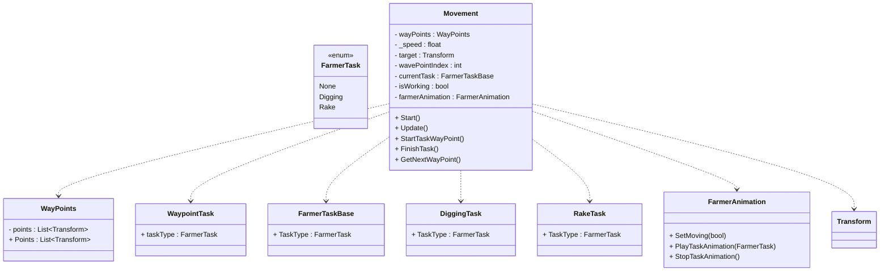

## Les 1 CodeConventies


in deze opdracht hebben we **InventorySystem** gemaakt in Unity. Controls zijn:
- Keycode(M) = MediPacks
- Keycode(G) = Guns
- Keycode (K) - Keycode

### hoe heb ik het aangepakt? 
ik heb gewerkt met **Abstracte** code wat we in Opdracht 5 gaan behandelen.
hierdoor kan mijn verschillende codes aangeven dat ze een naamgeving bijvoorbeeld moet hebben zodat de code over-
zichtelijk blijft en dat het niet rommelig. Hierdoor kan ik ook snel mijn fout zien wat mijn code werkt dan niet.

Vervolgens heb ik ook gebruikt gemaakt wat ik geleerd heb bij Opdracht 7. ik heb gebruik gemaakt van een **break**. Dat
houd in dat hij langs de statements gaat en als de Statement is geweest stopt die. en gaat die naar de volgende. Hierdoor
voorkom ik dat MediaPacks twee keer bijvoorbeeld wordt gepakt, want anders komt ie niet bij de Keycode of Guns aan.

Ten slot heb ik ook gebruikt gemaakt van  **naamgevingsconventies**,zodat je snel kan zien wat het is. Bijvoorbeeld:
-Private 
-Functie
-Class
Hierdoor houd je een overzicht.

[Bekijk hier mijn codes voor mijn Inventory](https://github.com/ilias195/Leerjaar2-United2-PROG/tree/main/Assets/Scripts/01-Code-Conventies/Inventory)

[Bekijk hier mijn codes voor mijn Items](https://github.com/ilias195/Leerjaar2-United2-PROG/tree/main/Assets/Scripts/01-Code-Conventies/Items)


## les 2 Class-Diagram Farmer (Unitled Goose)

in dit class diagram kun je  zien hoe het movement-systeem, waypoint-task en animaties van de farmer samenwerken. Ik heb een 
abstracte code gebruikt wat ik ga behandelen in opdracht 5, en omdat ik dus abstract heb gewerkt, kan ik mijn code makkelijk uitbreiden.
Daarnaast bepalen het taaktype via een enum waypoints en de Movement regelt wanneer iets gedaan moet worden en beheert het. Ten slot de animatie 
voert niks uit maar laat alleen zien wat er gebeurt.


## les 3 Data Structures


In deze Gifje kun je zien dat je met  ItemTemplates spullen kunt maken. Een item heeft een naam, soort, stats, prijs en een plaatje. 
Met een druk op de knop (SpaceBar) kun je een echt item maken en je kunt zien wat het doet in de console.
Zo is het makkelijk om nieuwe spullen te maken en te gebruiken in het spel.

[bekijk mijn scripts](https://github.com/ilias195/Leerjaar2-United2-PROG/tree/main/Assets/Scripts/03-Data-Structers)

## les 4 Delegates


in deze gifje kun je zien dat ik een Collectible item heb gemaakt. De item is een simple coin die word bijgehouden in de UI en een 
ScoreManager. De player kun je besturen met (WASD)

### Hoe heb ik het aangepakt ?

Om te beginnen heb ik voor de player een simple movement script gemaakt.
Vervolgens heb ik Collectible items gemaakt met een trigger collider.
Daarnaast stuurt elk item via een delegate (event) het aantal punten door
naar de ScoreManager. En de Scoremanager luistert naar dat event en telt de score op
 in de UI en die luistert ook. Hierdoor laat kan je score in zien in de UI.

 [Bekijk hier mijn Scripts](https://github.com/ilias195/Leerjaar2-United2-PROG/tree/main/Assets/Scripts/les4Delegets)

## Les 5 Abstractie 


in deze opdracht heb ik een **CollectibleSystem** gemaakt. je kan een Coin opakken die een Score bijhoud, 
 HealthPickup die Health geeft en tot slot een Damage-Trap die Health eraf houdt. De Controls voor de player is (WASD)

 ### Hoe heb ik het Aangepakt?
 ik heb gewerkt met Abstracte code. ik had één Script gemaakt die basis script zodat andere scripts kunnen over erven. 

 Vervolgens heb ik de Scripts Coin, Health, Damage aangemaakt en laten overerven. en elke script geeft ook een bericht je mee
 van ik ben opgepakt.

 Ten slot heb ik een ander Script aangemaakt PlayerStats. Die houd bij wat er opgepakt is en of dat er damage is gedaan.
 Om ervoor te zorgen dat je dat kan doen moet je Referentie maken tussen de scripts. En ik heb dat gedaan met een Action Event.
 ik heb een Action event gezet in Damage,Coin en Health. zodat ze ik referntie kan maken naar mijn PlayerStats script.
 Als laatst heb ik functies aangemaakt van elke Script met als vraag komt er scoren bij, komt er Health bij..? of gaat
 er Damage vanaf?

 [Bekijk hier mijn Scripts voor mijn Player](https://github.com/ilias195/Leerjaar2-United2-PROG/tree/main/Assets/Scripts/les5OOP%20Abstractie/Player)

 [Bekijk hier mijn Scripts voor Items](https://github.com/ilias195/Leerjaar2-United2-PROG/tree/main/Assets/Scripts/les5OOP%20Abstractie/Items)

 [Bekijk hier mijn Scripts voor mijn Managers](https://github.com/ilias195/Leerjaar2-United2-PROG/tree/main/Assets/Scripts/les5OOP%20Abstractie/Mangers)
 

## les 7 Early Returns
Dit script laat ik zien hoe je "early returns" gebruikt om ingewikkelde "if statement-logica"leesbaar te houden.

```csharp
using UnityEngine;

public class EarlyReturn : MonoBehaviour
{
    public bool IsPlayerReadyToAttack(Player player)
    {
     if (player == null) return false;
        
       //Level1
     if (!player.IsAlive) return false;

        //Level2
        if (player.AttackCooldown > 0) return false;

       //Level3
      if (player.Target == null) return false;
                   
           //Level4
        if (!player.Target.IsAlive) { return false; }
                        
         //Level5
     if (Vector3.Distance(player.transform.position, player.Target.transform.position) >= 5f) {  return false; }

        //Level6
        // Nog meer geneste conditions met && en ||
        bool ManaWeapon =
        (player.Mana >= 20 && player.WeaponEquipped);
        ManaWeapon = true;

       bool HasHealthBuff = 
       (player.Health > 30 && player.HasBuff("Strength"));
        HasHealthBuff = true;

        if (!ManaWeapon && !HasHealthBuff) {return false;}
                                
        //Level7
      if (!player.IsStunned || !player.IsSlowed) { return false;}
        return true;
    }
}
```
[Klik hier om de script te zien](https://github.com/ilias195/Leerjaar2-United2-PROG/tree/main/Assets/Scripts/les7EarlyReturns/Broken)


[Hier is de link naar mijn periode 1 opdracht](https://github.com/ilias195/Leerjaar2-United2-PROG?tab=readme-ov-file#les-1-codeconventies)
